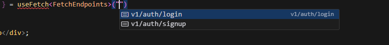

# API Fetch Library

This library provides a type-safe way to interact with your API endpoints as a wrapper around @tanstack/react-query.

## Installation

```bash
npm install @danstackme/api-fetch
```

## Setup

### 1. Set up ApiProvider

Wrap your app with the ApiProvider:

```jsx
import { ApiProvider } from '@danstackme/api-fetch';

const queryClient = new QueryClient();

const App = () => {
  return (
    <ApiProvider
      baseUrl="http://localhost:3000"
      queryClient={queryClient}
      fetchEndpoints={fetchEndpoints}
      mutateEndpoints={mutateEndpoints}
    >
        <YourComponent />
    </ApiProvider>
  );
};
```

### 2. Define Fetch Endpoints

Create a file to define your API endpoints:

```ts
import type { ApiDefinition } from '@danstackme/api-fetch';

type SignupRequest = { username: string; password: string };
type SignupResponse = { token: string };    

const fetchEndpoints = {
    "v1/auth/signup": {} as ApiDefinition<SignupRequest, SignupResponse>,
    "v1/auth/login": {} as ApiDefinition<{ username: string; password: string }, { token: string }>
} as const;

type FetchEndpoints = typeof fetchEndpoints;

export { fetchEndpoints, FetchEndpoints };
```

### 3. Use Fetch Hooks

Use the `useFetch` hook to fetch data. `useFetch` will auto-complete the endpoints found in the `fetchEndpoints` object and provide you with a type-safe way to interact with the API.

```ts
import { useFetch } from '@danstackme/api-fetch';

const { data, isLoading, error, refetch } = useFetch('v1/auth/signup', {
    body: { username: 'test', password: 'test' }
});

```



### 4. Use Do Hooks

Use the `useDo` hook to perform actions. `useDo` will auto-complete the endpoints found in the `mutateEndpoints` object.

```ts
import { useDo } from '@danstackme/api-fetch';

const { data, isLoading, error, refetch } = useDo('v1/auth/signup', {
    method: 'POST',
    body: { username: 'test', password: 'test' }
});

```

## Error Handling

The library provides a way to handle errors in your API calls. You can pass an `onError` function to the `ApiProvider` to handle errors globally.

```ts
import { ApiProvider } from '@danstackme/api-fetch';

const queryClient = new QueryClient();

const App = () => {
  return (
    <ApiProvider
        baseUrl="http://localhost:3000" 
        queryClient={queryClient} 
        fetchEndpoints={fetchEndpoints}
        onError={(err) => {
            console.log(err);
        }}
    >
        <YourComponent />
    </ApiProvider>
  );
};
```